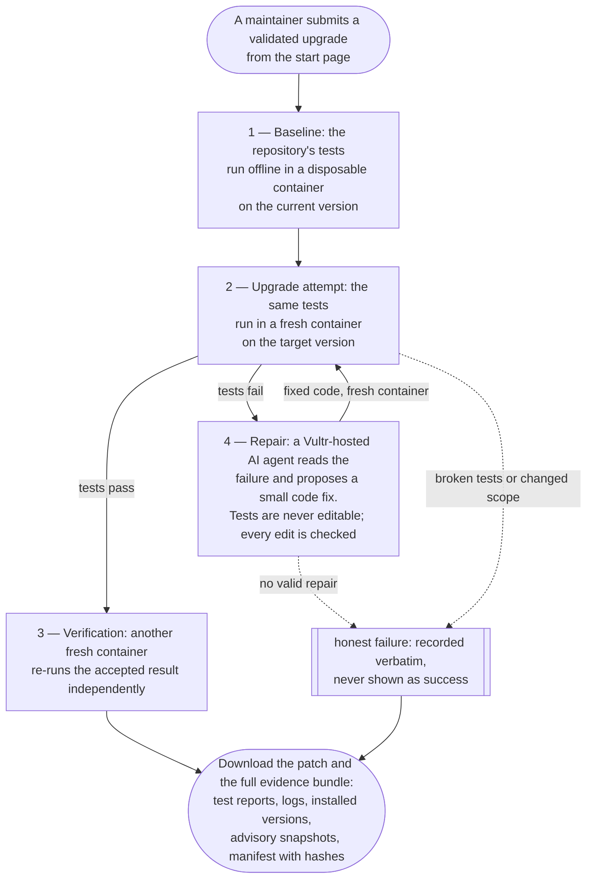
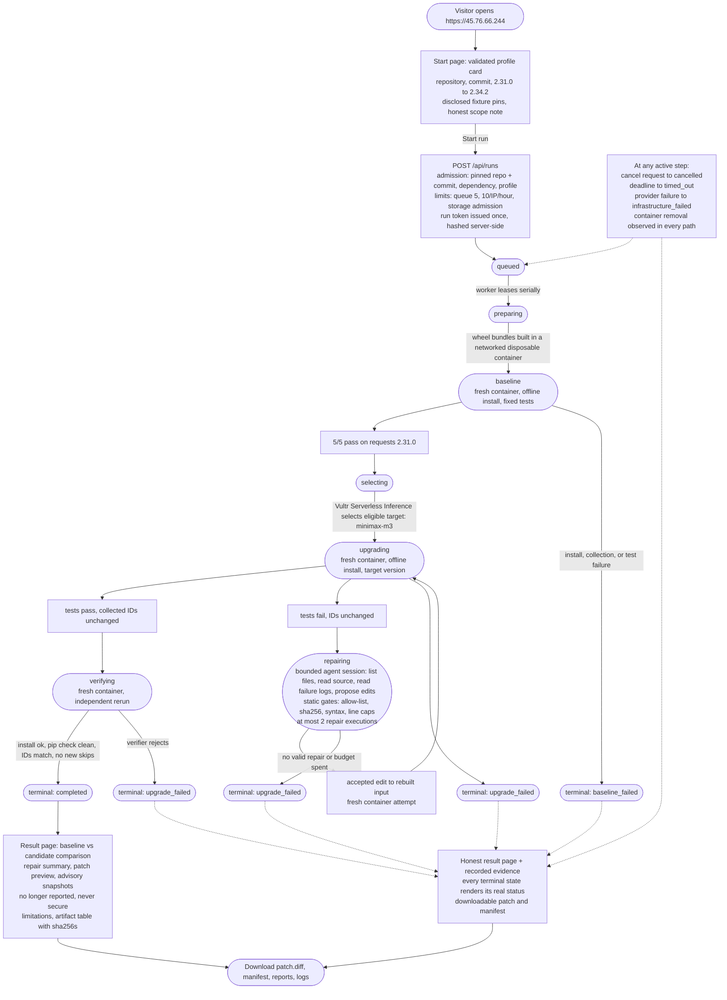

# Upgrade Chamber

Upgrade Chamber is a live demonstration of one Python dependency upgrade, tested against a repository's own test suite, repaired by a bounded agent when the upgrade breaks it, and reported with a downloadable patch and inspectable evidence. The product specification is in [mission.md](mission.md), with [technical design](tech-stack.md) and [delivery gates](roadmap.md).

At a high level, a run moves through this flow:



Newcomers who want the full detail — admission limits, agent bounds, and every terminal state — should continue to the [The run lifecycle](#the-run-lifecycle) section and its detailed diagram.

Product promise: **A dependency upgrade, tested against your repository, with the patch and evidence to review.**

The product is live at **https://45.76.66.244** on a Vultr VM behind Caddy. One note before the demo: because no public domain is configured, the site uses a self-signed certificate (Caddy's `tls internal` authority). Browsers show a certificate warning before the page loads; the connection is still encrypted, and accepting the warning is expected for this demo. With a real domain, changing the Caddy site address gives an automatic publicly trusted certificate — [deploy/Caddyfile.example](deploy/Caddyfile.example) documents that migration.

## Demo in one pass

1. Open https://45.76.66.244 and accept the certificate warning.
2. Click **Start run** with the prefilled example.
3. Watch the timeline: preparation, baseline tests, model selection, the failing upgrade, the agent repair, and independent verification — roughly 2–4 minutes end to end.
4. Inspect the result view: test comparison, patch preview, advisory panel, limitations, and artifact table.
5. Download the patch and evidence artifacts; each download lists its sha256.

## What is proven live

Every claim below maps to a recorded run; the evidence directories are retained on the VM and summarized in [docs/implementation-checklist.md](docs/implementation-checklist.md) and [docs/RESUME.md](docs/RESUME.md).

- **One execution profile is enabled.** `requests-unixsocket-historical-0.3.0-research` reproduces the public [msabramo/requests-unixsocket](https://github.com/msabramo/requests-unixsocket) repository at commit `8449bc0f76a2ce410644b5e8aab45829ddca54f7`, upgrading requests 2.31.0 → 2.34.2 with disclosed fixture pins (the profile's disclosure names every pinned wheel). The public catalog explains this profile and separately lists the unvalidated research candidate; unsupported repositories receive a clear explanation before execution.
- **The full workflow completed live.** Runs 14, 16, and 17 progressed `queued → preparing → baseline → selecting → upgrading → repairing → upgrading → verifying → completed` end to end: a real model selection through Vultr Serverless Inference (the currently configured model is `minimax-m3`, chosen by live reliability probing after `glm-5.3-flash` burned its completion budget on hidden reasoning tokens), a real bounded agent repair session, a real compatibility fix — an override of `UnixAdapter.get_connection_with_tls_context` in `requests_unixsocket/adapters.py` — and independent verification in a fresh disposable container (5/5 tests on requests 2.34.2, `pip check` clean, collected test IDs unchanged from the baseline).
- **The agent session is real and bounded.** The model operates a fixed controller-defined tool set — `list_repo_files`, `read_file` (which reports the file's current sha256 and must be cited as `original_sha256` for edits to that file), `read_test_log`, `propose_edits` (static validation feedback only), `finish`, `abort` — one structured turn per inference call, at most 12 turns per repair session, at most 2 repair executions per job, at most 26 inference calls per job. The controller runs every container, decides every verdict, and never lets the model run shell commands, alter limits, or choose its own tools.
- **Honest failures are part of the evidence trail.** Early runs recorded provider empty-completion and timeout failures (diagnosed as reasoning-token starvation against `max_tokens`), one run ended `upgrade_failed` after two repair attempts did not pass, and every terminal state is recorded verbatim — including the `provider_error` events, with no fabricated pass counts.
- **Containment is recorded, not asserted.** The recorded probes show the watchdog timeout kill at its deadline, a cgroup OOM kill at the enforced 1 GiB limit (exit 137), a successful recovery probe, a cancellation that removed the active container, and zero owned containers after every recorded run.
- **Advisory evidence is honest.** Baseline snapshots recorded six known advisory IDs on requests 2.31.0 and the target snapshot recorded zero on the installed 2.34.2; the result view says "Target advisory no longer reported for this installed version," never "secure."

## Architecture

**Services.** A FastAPI API listens only on loopback `127.0.0.1:8000` and is the only service holding the Vultr inference key. A separate worker service has Docker access and no inference key; it leases queued runs over the shared SQLite database and drives each phase. Caddy serves the static React/Vite frontend and reverse-proxies `/api` to the API. Records live in SQLite (WAL mode) as runs, attempts, events, artifacts, and an advisory cache. Execution runs in a digest-pinned `python:3.11-slim` image.

**Trust boundaries.** The API holds the inference key; the worker holds the Docker socket; neither credential crosses to the other side. Execution containers receive no inference key, no provider credentials, no Docker socket, no application filesystem mounts, and no network. Run access uses a per-run token issued once at submission, stored in browser `sessionStorage`, sent as a bearer header, and hashed server-side. Same-origin enforcement rejects cross-origin requests.

**Execution policy.** Containers run with a read-only root filesystem as uid 10001, all Linux capabilities dropped, `no-new-privileges`, 1 vCPU, 1 GiB memory, 128 PIDs, and no network (`bridge` only for the bounded wheel-preparation container). Work and temporary storage are tmpfs (512 MiB and 128 MiB). Input staging and artifact export use a bounded exec transport with explicit stream-framing demux — no bind mounts, no untrusted archive extraction onto the host — and every Docker and socket call is bounded by a monotonic deadline owned by the worker's watchdog.

**Agent design.** Selection and repair are structured inference calls through one internal endpoint; model output is validated against server-owned schemas (with at most one format-correction retry per call). `propose_edits` sees static validation only — path allow-list, per-edit `original_sha256` hash match, protected-file rejection (tests, conftest, pytest options, CI), patch file/line caps, and standalone-Python syntax checks — and repair acceptance comes only from fresh controller-run container verdicts, never from the model's own claim.

## The run lifecycle

`queued → preparing → baseline → selecting → upgrading → [repairing → upgrading] → verifying → completed`

Baseline must pass before any mutation. The verifier is deterministic controller logic — fresh source, accepted edits, the profile's fixed command, matching collected test IDs, no new skips or xfails, `pip check`, and an installed-version scan — not a second model call.

Terminal outcomes and their meanings (completed, unsupported, baseline_failed, upgrade_failed, timed_out, cancelled, infrastructure_failed) are defined in the [honest-language table in mission.md](mission.md#results-and-honest-language). Cleanup is recorded as a separate status so a passing test never conceals a failed container removal.

The complete flow from visitor to downloadable evidence:



The services and credential separation behind these steps are drawn as an infrastructure diagram in the [Deployment and trust boundaries section of tech-stack.md](tech-stack.md#deployment-and-trust-boundaries).

## Local setup

Use Python 3.11. With `uv`, install locked dependencies, run the tests, and start the API:

```sh
uv sync --frozen --extra test
uv run --frozen --extra test python -m pytest
uv run --frozen uvicorn upgrade_chamber.api:app --host 127.0.0.1 --port 8000
```

Alternatively, with an existing Python 3.11 interpreter:

```sh
python -m pip install -e '.[test]'
python -m pytest
uvicorn upgrade_chamber.api:app --host 127.0.0.1 --port 8000
```

The local suite covers 228+ cases: API admission and authorization, the agent session and edit validation, the runner's container policy and bounded exec transport, storage, OSV handling, and the inference transport against stubs. They are stubbed tests, not evidence of a live run.

The API needs `DATABASE_PATH`, `ARTIFACT_DIR`, and `WORKER_IMAGE` in the environment before it starts; without them, startup fails fast with an explicit error naming the missing settings instead of serving a half-configured API. With those set but no inference configuration, `GET /healthz` and `GET /api/profiles` still serve, and submissions are admitted — a run then ends honestly at the selection phase with an `inference_unavailable` failure rather than pretending to work.

Copy `.env.example` to a local `.env` to configure inference. It defines `VULTR_INFERENCE_API_KEY` (a Vultr Serverless Inference key) and `VULTR_MODEL_ID` (a model ID chosen from the account's available models). Do not commit `.env`; the application does not read `.env` automatically. To inspect available models and make a real structured-response smoke call:

```sh
uv run --frozen --env-file .env upgrade-chamber-inference models
uv run --frozen --env-file .env upgrade-chamber-inference smoke
```

Both commands call only Vultr's inference API and never print the key. Mocked unit tests do not establish provider availability.

## Deployment

The live deployment runs on a Vultr Ubuntu 24.04 VM: a 4 vCPU / 8 GiB host, pinned uv 0.11.8, `deploy/bootstrap.sh` installing two unprivileged systemd services (`upgrade-chamber-api` without Docker access, `upgrade-chamber-worker` with Docker access and no inference key), root-owned environment files (`0600` for the API including the inference key, `0640` for the worker with only database, artifact, and image settings), the digest-pinned runner image, and Caddy serving the built frontend plus `/api` on 443 with a firewall limited to 80/443 plus SSH.

Full, reviewable steps — including the frontend build/upload, the Caddyfile, and the domain migration from `tls internal` to a publicly trusted certificate — are in [deploy/README.md](deploy/README.md) and [deploy/Caddyfile.example](deploy/Caddyfile.example). They are not duplicated here.

## Evidence and honest interpretation

Every run records attempts, events, and artifacts. The downloadable bundle contains `patch.diff`, `comparison.json`, `manifest.json`, per-attempt reports (`attempt.json`, `collect.txt`, `junit.xml`, `pip-report.json`, `pip-check.txt`, `installed.json`, `install.log`, `test.log`), and advisory snapshots for the baseline and target versions. The manifest carries the schema version, repository URL and resolved commit, profile ID, source digest, image digest, model identity and rationale, dependency changes, test scope, timestamps, limitations, and artifact hashes. Downloads are authenticated with the per-run token and served as attachments; the artifact table in the result view lists each file's sha256 and byte count.

Reading results:

- A verified result means the fresh rerun passed the executed suite under the recorded pinned environment; it does not prove complete application correctness or exploitability.
- The advisory panel reports what OSV returned for the exact installed versions, with query timestamps; "target advisory no longer reported for this installed version" is the strongest claim the UI makes — never "secure."
- Failures stay visible: baseline failures stop mutation, provider errors and timeouts are recorded verbatim, and cleanup is reported separately from the test verdict.

Live evidence directories (`g1-…`, `g2-…`, `g4-…`, `demo-e2e-…`) are retained on the VM under `/root/upgrade-chamber-evidence/` outside automatic pruning. The repository itself commits no secrets and no run logs.

## Limitations and security boundaries

- Results prove compatibility with the executed suite under the recorded pinned environment only. They do not establish application correctness, exploitability, or absence of vulnerabilities in code paths the suite does not exercise.
- Execution is restricted to the one validated profile; this is not arbitrary-repository support. Unsupported inputs receive a clear refusal before execution.
- Docker containers share the host kernel. This implementation demonstrates configured process and resource isolation, not a hardened multi-tenant service; a dedicated execution VM and microVM isolation are future work, not silently claimed here.
- The demo certificate is self-signed (no domain configured). The connection is encrypted; the browser warning is expected.
- Agent repairs are bounded — fixed tools, turn and inference-call budgets, static validation, controller-run verdicts — and can fail honestly; a failed repair records itself rather than being retried silently or hidden.
- Reports produced inside a container are treated as untrusted artifacts: fresh verifier reruns and protected-file checks improve the evidence but do not defeat a deliberately malicious repository, which is why curated profiles are part of the boundary.

## Repository layout

- `src/upgrade_chamber/` — API, worker, Docker runner, agent session, profiles catalog, storage, OSV and inference transports
- `execution/` — container image definition and the in-container attempt runner
- `web/` — React + TypeScript + Vite frontend (plain CSS)
- `deploy/` — bootstrap script, systemd units, Caddyfile example, deployment guide
- `profiles/` — research candidate metadata
- `scripts/` — baseline preparation and operator experiment scripts
- `tests/` — the local stubbed suite
- `docs/` — implementation checklist and handoff notes
- `mission.md`, `tech-stack.md`, `roadmap.md` — specification, architecture and limits, delivery plan
- `.env.example` — inference configuration template (no secrets committed)

## Submission

- Repository: https://github.com/dev-sri67/upgrade-chamber
- Live demo: https://45.76.66.244 (accept the self-signed certificate warning)
- Demo video: recorded browser footage exists on the VM at `/root/upgrade-chamber-evidence/demo-e2e-3/`, and a narrated demo video is produced from that footage.
- Evidence state and acceptance gates: [docs/implementation-checklist.md](docs/implementation-checklist.md)
