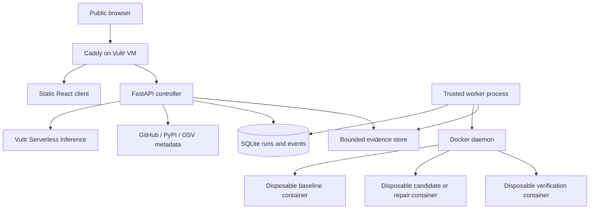

# Upgrade Chamber — Technical Specification

Status: proposed stack and contracts for the 24-hour MVP. Companion product requirements: [mission.md](mission.md). Delivery gates: [roadmap.md](roadmap.md).

## Stack decisions

| Layer | Choice | Reason |
| --- | --- | --- |
| Web client | React, TypeScript, Vite, plain CSS | Small deployable client; no server-rendering requirement. |
| API/controller | Python 3.11, FastAPI, Pydantic | Structured API and model-output validation; shared language with the runner. |
| Reasoning | OpenAI-compatible client pointed exclusively to Vultr Serverless Inference | Meets the required inference path; model ID is configuration. |
| Persistence | SQLite in WAL mode | Sufficient for one controller and one serial worker; avoids a database service. |
| Execution worker | Separate trusted Python process with Docker SDK | Fixed container policies and external deadlines; no repository imports in the controller. |
| Execution image | Project-owned Python 3.11 image, pinned by digest | Prepared pytest/tooling and bounded offline dependency bundles. |
| Test evidence | Pytest collection output, JUnit XML, process exit status, captured logs | Machine-readable comparison plus inspectable output. |
| Advisory data | OSV API, exact installed package versions | Before/after known-advisory evidence. |
| Release metadata | PyPI JSON API | Eligible versions and Python compatibility; reject prereleases/yanked releases by default. |
| Deployment | Vultr Ubuntu VM, Caddy HTTPS, systemd services | Few moving parts, public frontend/API, supervised processes. |
| Artifacts | Restricted VM filesystem, served through the API | Adequate for bounded demo runs; no object storage dependency. |
| Live status | REST polling every two seconds | Simplest reliable implementation; SSE is optional after the core works. |

Pin application dependencies at implementation time. Do not invent a Vultr model ID or assume tool calling/JSON mode is supported. Check the account's available models, run a structured-output smoke test, and store the successful choice in configuration. No fallback to another inference provider.

## Deployment and trust boundaries

One Vultr VM is the hackathon topology. Start sizing at 4 vCPU / 8 GB RAM and validate actual availability and resource use. Limit execution concurrency to one container. Reserve capacity for the controller and OS.

The API holds the inference key. The worker service has Docker access and no inference key. Only the trusted worker controls Docker. The API cannot accept Docker flags, host paths, image names, shell commands, or mounts from a user or model. The worker accepts a fixed job schema and resolves a server-owned profile.

Docker containers share the host kernel. This implementation demonstrates configured process/resource isolation, not a hardened hostile multi-tenant service. Public execution is restricted to validated profiles and globally rate-limited. A separate execution VM and gVisor/microVM isolation are post-MVP improvements; neither is silently claimed as implemented.

## Repository and dependency preparation

1. Accept only canonical public `github.com/owner/repo` inputs; resolve refs via a fixed GitHub API route. Reject arbitrary URLs, local paths, submodules, and Git LFS requirements.
2. Fetch the exact commit archive from GitHub's approved archive host. Validate redirects, length, and time limits. Never accept a repository-provided download URL.
3. Extract inside a disposable preparation container. Reject absolute paths, traversal, symlinks, hard links, devices, excessive file counts, and decompression beyond limits. Do not execute repository code while inspecting metadata.
4. Use a profile-owned dependency specification. Reject URL/VCS/editable dependencies, extra indexes, and arbitrary requirements-file options in the MVP. Installation is also untrusted execution.
5. Pre-stage wheel-only dependency bundles for the validated baseline and target, with names, versions, and hashes recorded. The supported target set is small and explicit. Download packages in a separate bounded preparation sandbox; inspect the approved package origins. If safe restricted download cannot be completed, support only the pre-staged profile bundles.
6. Install and test with networking disabled using `pip --no-index --find-links` against the bundle. No source distributions or native builds in the MVP. A profile needing a local project installation must explicitly support offline build dependencies and execute that installation only in the sandbox.

This avoids implementing a general package egress proxy during the hackathon. A newly requested version without a prepared bundle is unsupported, not a reason to enable unrestricted networking. No GitHub or registry token enters a preparation or execution sandbox.

## Execution policy

| Control | Initial policy |
| --- | --- |
| User | Non-root execution UID/GID |
| Privileges | Drop all Linux capabilities; no-new-privileges; default seccomp; no privileged mode |
| Namespaces | No host PID, IPC, or network; no device passthrough |
| Network | `none` for installation, tests, repair evaluation, and final verification |
| Filesystem | Read-only image root; bounded writable tmpfs for work and temporary files |
| Host access | No bind mounts of host/application directories; no Docker socket |
| CPU | 1 vCPU quota per execution container |
| Memory | 1 GiB hard limit, no additional swap allowance |
| Processes | 128 PIDs |
| Work storage | 512 MiB tmpfs; memory accounting must fit within the container cap |
| Temporary storage | 128 MiB tmpfs; fail clearly on exhaustion |
| Deadlines | 120 seconds installation; 120 seconds per test command; 300 seconds per attempt; 900 seconds per job |
| Source input | 10 MiB compressed, 50 MiB extracted, 5,000 files |
| Logs | 2 MiB captured per stream per attempt; truncate explicitly; bound Docker logging too |
| Export | 20 MiB total artifacts per job; text/JSON/XML/diff only |
| Repairs | At most two, each under the remaining job budget |
| Patch | At most five application/dependency files and 200 changed lines |
| Queue | One active job, at most five queued; three submissions per IP per hour initially |

These values are chosen MVP defaults, not benchmark results. Change them only after profiling and update the documented policy. The watchdog is owned by the worker and terminates the whole container. Cancelling an HTTP request is not sufficient cleanup.

Use a fixed runner to stage inputs into tmpfs after container start. Capture reports while the container exists, then remove it in a `finally` path. Validate exported paths and byte counts; never blindly extract an untrusted container-produced archive onto the host. Sanitize terminal control characters for display and serve artifacts as attachments. Use an XML parser with external entities disabled.

Persist container IDs, job ownership labels, deadlines, and cleanup results. On startup and periodically, remove expired containers owned by this application only. Mark interrupted jobs explicitly; do not silently resume a partly applied repair.

## Agent contract

The controller implements a fixed state machine and owns every execution limit. Repair is an agentic but strictly bounded session: the model operates a fixed, controller-defined tool set (`list_repo_files`, `read_file` for read-only file access including tests — `read_file` reports the file's current sha256, which the model must use as `original_sha256` for edits to that file, `read_test_log`, `propose_edits`, `finish`, `abort`) and returns one structured turn per inference call through the controller; a repair session runs at most 10 turns. It never chooses its own tools, alters execution limits, runs shell commands, or decides whether tests passed. `propose_edits` receives static validation feedback only; the controller runs the container and feeds the real results back within the same bounded session. At most two repair executions per job are permitted, and repair acceptance comes only from fresh controller-run container verdicts.

Model input contains the user request, normalized eligible package versions, relevant dependency/application files, advisory summaries, and bounded test errors. Repository instructions and logs are untrusted data, not policy. Exclude credentials and unrelated files.

Expected model outputs:

- Selection: a single structured call returning `{package, target_version, rationale}` where the target belongs to the server-provided eligible list.
- Repair: a bounded tool loop that ends with `{summary, edits: [{path, original_sha256, replacement_text}]}`.

Validate outputs with Pydantic; at most one format-correction retry per call. Structured outputs pass through a bounded fence/prose-tolerant JSON extraction before the single correction retry. Cap each response and the total inference budget. Enforced budget: at most 10 model turns per repair session, at most 2 repair executions per job, at most 18 inference calls per job, and 60 seconds per call (up to 300 seconds for repair agent turns); prompts are bounded to 24 messages and 64 KiB. Selection uses a 4096-token completion budget and repair agent turns use 32768, because hidden reasoning counts against max_tokens on the provider. If usage metadata is missing, enforce request-size and call-count limits regardless. The transport retries an empty provider completion up to twice more with a short backoff before failing; provider-level retries stay bounded and are recorded in the attempts count of the structured layer only when they surface there.

Validate edits before applying them in a disposable environment. Paths must be profile-allowed relative paths, existing file hashes must match, and protected files cannot change. Reject binary edits, symlinks, oversized changes, and modifications to tests, conftest, pytest options, build hooks, or CI. Produce the downloadable diff deterministically from original and accepted source.

## State machine and verifier

`queued -> preparing -> baseline -> selecting -> upgrading -> [repairing -> upgrading] -> verifying -> completed`

Terminal alternatives: `unsupported`, `baseline_failed`, `upgrade_failed`, `timed_out`, `cancelled`, `infrastructure_failed`. Store cleanup as a separate status so a successful test does not conceal failed removal.

Baseline must pass before mutation. Store exact collected node IDs, pass/fail/error/skip/xfail counts, source digest, Python version, image digest, actual installed package inventory, and pip installation report. Preserve unrelated dependency versions where feasible; report every resolver-induced change.

Verification uses a fresh source snapshot plus the accepted edits and the same profile command. Require successful install, nonzero test collection, matching test IDs, no new skips/xfails, passing required tests, and unchanged protected-file hashes. Check `pip check`. Query OSV for exact installed versions, including transitive dependencies, before and after; cache by package/version and retain query timestamps.

The verifier is deterministic controller logic, not a second LLM. Reports produced inside a container are still untrusted artifacts: fresh reruns and protected tests improve evidence but do not defeat deliberately malicious repositories that spoof results. Restricting MVP profiles is part of this boundary.

## API and records

| Endpoint | Contract |
| --- | --- |
| `GET /api/profiles` | Supported examples, constraints, and candidate dependencies |
| `POST /api/runs` | Validated repo/ref/dependency/profile; idempotency key; returns run ID and access token |
| `GET /api/runs/{id}` | State, comparison summary, limits, deadlines, and cleanup |
| `GET /api/runs/{id}/events?after=N` | Ordered persisted events for reconnectable polling |
| `POST /api/runs/{id}/cancel` | Owner-authorized cancellation request |
| `GET /api/runs/{id}/artifacts/{name}` | Authorized bounded attachment download |
| `GET /healthz` | API health; readiness separately checks worker heartbeat and queue capacity |

Use an unpredictable per-run token kept in browser session storage and supplied as an authorization header. Never put it in URLs or logs. Hash it server-side. Enforce same-origin requests, submission limits, and a global operator kill switch. Do not provide a public list of run contents.

SQLite tables: `runs`, `attempts`, `events`, `artifacts`, `advisory_cache`. Atomically lease one queued job; record worker heartbeat and lease expiry. Persist state before emitting an event. All timestamps are UTC. Events have increasing sequence IDs.

## Evidence bundle

`manifest.json`, `patch.diff`, `baseline/junit.xml`, `verification/junit.xml`, per-attempt stdout/stderr, collection results, installed inventories, pip reports, OSV snapshots, model selection/repair summaries, and `containment.json`.

The manifest includes schema version, repository commit, profile ID, input/output digests, image digest, Python version, dependency changes, test scope, timestamps, result limitations, and artifact hashes. Hashes support consistency checks; they do not establish third-party attestation. Reports must not contain API keys or hidden model reasoning.

Keep artifacts for 24 hours, with a 1 GiB total store cap. Prune expired terminal runs before admitting work; reject submissions if sufficient storage is unavailable. Preserve explicitly exported demo evidence outside automatic pruning.

## Required validation

- Allowed reference repo: baseline, candidate, actual repair if applicable, and independent verification.
- Reject test edits, traversal paths, unsupported URLs, package index overrides, and zero-test results.
- Timeout, cancellation, memory exhaustion, output flooding, and orphan cleanup.
- Verify that execution has no provider credentials, Docker socket, host filesystem mount, or outbound network.
- Simulated OSV/provider failures produce honest statuses.
- Browser reload restores run progress; patch and evidence downloads work over public HTTPS.

## Sources

- [Vultr Serverless Inference provisioning](https://docs.vultr.com/products/compute/serverless-inference/provisioning).
- Required inference base URL from the challenge: `https://api.vultrinference.com/v1`.
- [Docker security model](https://docs.docker.com/engine/security/).
- [OSV API](https://google.github.io/osv.dev/api/).
- [Pip installation reports](https://pip.pypa.io/en/stable/reference/installation-report/).
